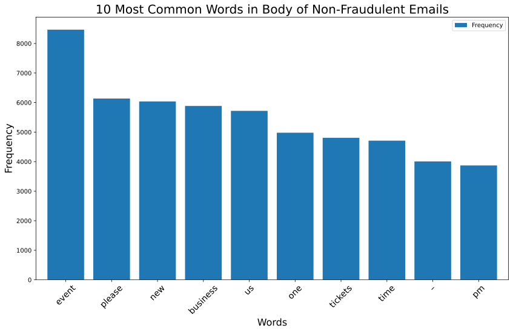
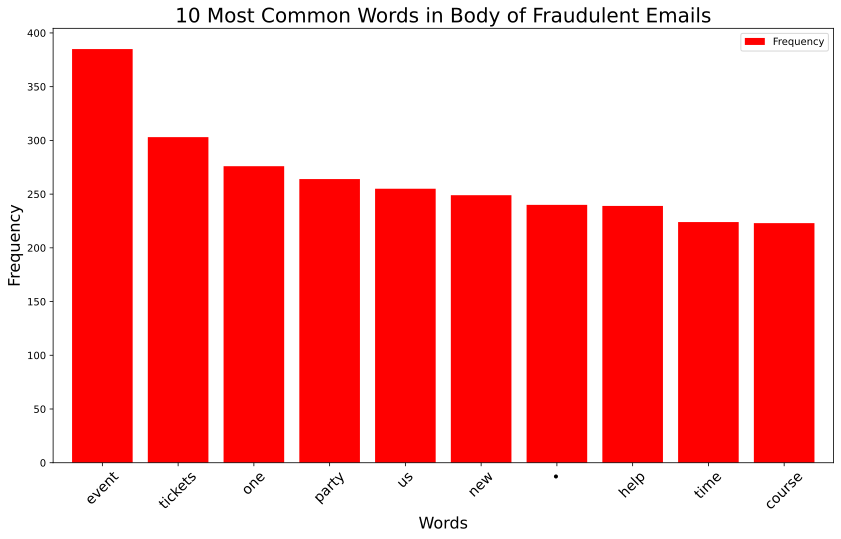

<div align="center">  
<header>
    <h1>Who You Gonna Call?<br>
    Fraud-Busters</h1>
  </header>
<div align='left'>  

<div align="center"> 

<div align='left'> 


## Table of Contents
1. [Background](#background)
2. [Data](#data)
3. [EDA](#eda)
4. [Models and Analysis](#models-and-analysis)
5. [Web App](#web-app)

## Background

Our team, the Fraud-Busters, was hired by an e-commerce site to weed out fraudsters. The fraudsters sent emails to users with fraudulent event tickets for purchase, and the e-commerce site would like to weed out these emails and events so no consumers click the links to purchase fradulent event tickets. The e-commerce site would like a web application that can be used to quickly triage potential fraudulent transactions as low risk, medium risk or high risk.   


## Data  

### Initial Data
We started with a json file of the current data from the e-commerce site. Any of the date columns had to be converted to datetime from a Unix timestamp in seconds. We cleaned up the description column to make it easier to use in our models.  

We engineered a target column ```Label``` that is set to 1 if the transaction is fraudulent and 0 if it is not fraud based on the data in the ```acct_type``` column. 


## EDA

### What is Fraud?  

Failures are not created equal:
-  False positives decrease customer trust
-  False negatives cost money, and not all of those cost the same amount of money

The model will not necessarily flag incoming transactions as fraud or not fraud, but instead allows the transactions to be flagged as needing further review due to the risk level. This is why the model is one that triages the most pressing (aka costly) transaction coming in.

### Can We See a Difference in Words Used?

  

  

### Cleaning Up the Feature Matrix

We dropped dropped any features that were text heavy or included dates. We then engineered features by parsing out some of the original ones such as:
-  ```Ticket_Types``` was engineered into ticket cost, ticket availability, and amount of total tickets
-  ```Previous_Payouts``` was engineered into a boolean (1 or 0) for if there was a previous payout or not

## Models and Analysis

### Choosing Our Model
Our team decided to build a variety of baseline models to compare before settling on the best model:
- KNN
- Logistic Regression
- SVM SVC
- Random Forest

We compared models using the following three metrics:
> **Precision** - how many selected items are relevant  
> **Recall** - how many relevant items are correctly selected  
> **F1-score** - accuracy  

For our model, with Fraud = 1 (true positive), a high recall score would imply we are correctly identifying all fraudulant transactions and reducing false negatives; thus, if we are flagging user accounts to prevent theft we would not miss any. However, if we are discussing cost relating to investigating transactions, we would want a high precision score which implies we are reducing the number of false positives (falsely identified as a threat). Likewise, if we wanted to just compare models based on accurately identifying Fraud and Not-Fraud we would look at the F-1 score. Based on all three scores, we chose the Random Forest model.

<div align="center">   

| **Model** | **Precision** |  **Recall** | **F-1 Score** |  
| :------: | :--------: | :-------: | :---------: |  
|K-Nearest Neighbors | 0.68 | 0.51 | 0.58 |  
| Logistic Regression | 0.92 | 0.78 |  0.84 |  
| SVM | 0.14| 0.82| 0.24 |  
|**Random Forest** | **0.95** | **0.91** |**0.93** |   

<div align='left'>  


### Final Model

After tuning our hyperparameters with a grid search, we finalized our Fraud-Busters random forest fraud detection model and saved it with [pickle](src/bestRTModel.pkl). 

We investigated which features of the data were most important in flagging an incoming transaction as fraud or not-fraud. Based on the feature importances from our model, ```Previous_Payout``` is the most important factor affecting if a transaction is flagged as fraud or not-fraud. 


### Predicting with Our Model


- predict.py from test_script_examples file
- create database to store predictions

### Cost of Investigating Fraud with Our Model
??

## Web App

### Fraud Scoring Service
 - link to web app and maybe screenshot

### Live Data
We created a pipeline for taking in live [data](http://galvanize-case-study-on-fraud.herokuapp.com/data_point) and configuring it to run through our pickled model. The incoming data is stored in a database along with the prediction that is returned from running the data through the model. 

